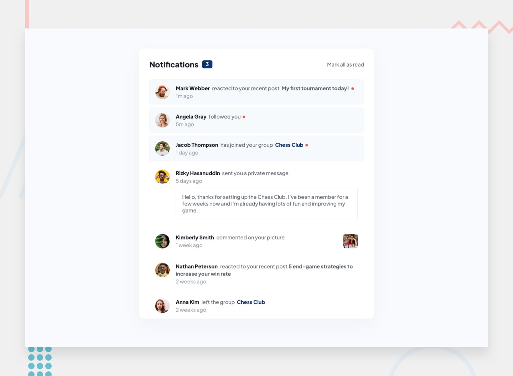

# Notifications Page

A responsive notifications page built as part of a Frontend Mentor challenge.

## Live Demo

[View the live site](https://notifications-page-three-rose.vercel.app/)

## Repository

[View the GitHub repository](https://github.com/DevAdeh/Notifications-Page.git)

## Screenshot

## About the Project

This project is a responsive notifications page based on a Frontend Mentor design.

The page displays a list of notifications and visually separates unread notifications from those that have already been read. Users can also mark all notifications as read.

The notification content is stored as JavaScript data and rendered dynamically on the page.

## Features

- Responsive layout for desktop, tablet, and mobile screens
- Seven notification items
- Unread notification styling
- Dynamic unread notification counter
- Mark all notifications as read
- Dynamic rendering with JavaScript
- Hover and focus states for interactive elements
- Responsive design using CSS media queries
- Accessible buttons and basic screen-reader feedback

## Built With

- HTML5
- CSS3
- JavaScript
- CSS Grid
- CSS custom properties
- JavaScript arrays and objects
- `map()`
- `filter()`
- DOM manipulation
- Event listeners
- Responsive design

## What I Learned

This project helped me understand how JavaScript can be used to create and update parts of a webpage dynamically.

Some of the concepts I practiced include:

- Working with arrays of objects
- Using `map()` to turn data into HTML
- Using `filter()` to find unread notifications
- Using event listeners to respond to user actions
- Updating the DOM with JavaScript
- Using JavaScript state to control CSS classes
- Creating responsive layouts with CSS Grid and media queries

## Challenges

One of the main challenges was understanding how to take notification data stored in JavaScript and use it to create the notification cards on the page.

Another challenge was implementing the "Mark all as read" functionality. The notification objects have an `unread` property, and JavaScript updates that value before rendering the notifications again.

This helped me understand the relationship between data, JavaScript, and what is displayed in the browser.

## What I Would Improve

If I continued working on this project, I would:

- Improve the accessibility of the notification interactions
- Add more detailed keyboard testing
- Improve the animation and interaction feedback
- Refactor the JavaScript further as my understanding grows
- Explore how the same project could be built using React

## Author

**Adeola Ejikunle**

- GitHub: [@DevAdeh](https://github.com/DevAdeh)

## Acknowledgments

- [Frontend Mentor](https://www.frontendmentor.io/) for providing the challenge and design
